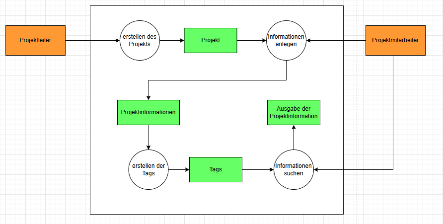
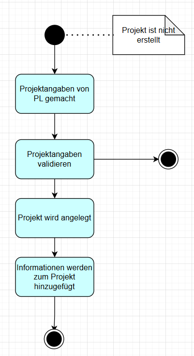
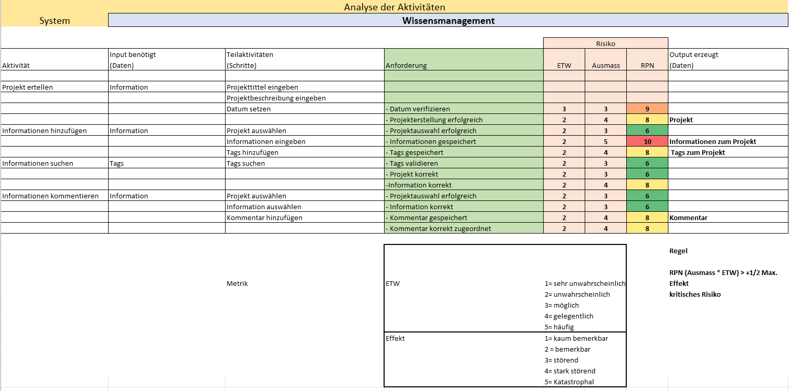

# Wissensmanagement

## Situationsanalyse

Die IT-Firma Xarelto möchte ein Wissensmanagementsystem einführen, um die Effizienz und den Wissensaustausch in Projekten zu verbessern.

Der Projektleiter (PL) kann ein neues Projekt starten und grundlegende Informationen zum Projekt abgeben.
Während dem Projekt kann das Team neue Informationen zum Projekt hinzufügen, wie Texte, Bilder (URL) und andere Dokumente (URL).
Die Information kann mit maximal drei Tags gekennzeichnet werden.
Es sollten auch nachträglich Kommentare zu den Projektinformationen hinzugefügt werden können. Diese sollen jedoch klar vom Originaltext abgegrenzt werden.
Durch die Möglichkeit, nach Tags zu suchen, wird das Finden relevanter Informationen erleichtert.

## Planung

Zu Beginn unseres Projektes haben wir alle Tätigkeiten aufgelistet und die dafür benötigte Zeit geschätzt.
In der nachfolgenden Tabelle sind alle geschätzten und effektiv geleisteten Stunden ersichtlich:

## Kontext Map

Nach Analyse der Situation und Ausgangslage hat sich folgende Kontext Map ergeben:

Der Projektleiter erstellt ein Projekt, anschliessend werden Informationen erstellt, welche dann mit Tags versehen werden können.

Die Tags werden jeweils den Informationen zugeordnet. Die Informationen einem Projekt.

## Kontext Diagramm

Aus der Kontext Map konnte auch das Kontext Diagramm erstellt werden:

Der Projektleiter erstellt ein Projekt, anschliessend werden Informationen angelegt, welche mit Tags versehen werden können. Nach den Informationen kann dann gesucht werden und die Projektinformation wird ausgegeben.

## Use Case Diagramm

Im Use Case Diagram wird der Ablauf bei der Erstellung eines neuen Projekts gezeigt.

## Kommunikationsdiagramm

Im Kommunikationsdiagramm wird die Informationserstellung erläutert:

Der Projektleiter legt das Projekt an. Anschliessend werden die Projektinformationen angelegt, welche dann wiederum ausgegeben werden bei einer Suche.

## Zustandsdiagramm

Im Zustandsdiagramm wird der Zustand des Projekts erläutert:

## Klassendiagramm

Anschliessend hatten wir ein genug grosses Verständnis vom Projekt, um die Klassen definieren zu können.
In einem ersten Entwurf haben wir unsere Klassen wie folgt definiert:

Wir benötigen drei Klassen:

- Tag
- Info
- Projekt

Ein Projekt beinhaltet Informationen. Die Informationen wiederum enthalten Tags.
Nach diesen kann bei einer Suche gesucht werden.

Zum Projekt gehört ein Titel, ein Datum, Informationen und Tags.

Während der Programmierung haben wir das Klassendiagramm anpassen müssen, da es nicht alle von unseren Anforderungen erfüllt hat.
Das finale Klassendiagramm sieht wie folgt aus:

Im finalen Klassendiagramm haben wir vier Klassen:

- Tag
- Info
- Projekt
- WissensmanagementApp

Die Klasse WissensmanagementApp haben wir in einem zweiten Schritt hinzugefügt,
da wir einige Funktionen benötigten um die Anforderungen an unser Wissensmanagement zu erfüllen.

Bei der Klasse Info haben wir zu Beginn vergessen, dass auch Kommentare zu Information gemacht werden können.
Deshalb haben wir diese noch zur Klasse hinzugefügt.

## Anforderungsanalyse

In unserem Projekt haben sich folgende Anforderungen und Risiken ergeben:

Das grösste Risiko für unser Projekt wäre, wenn Informationen zum Projekt nicht gespeichert würden.
Dies wäre kritisch, da somit Informationen verloren gehen würden.
Wenn eine Information zwar erstellt wurde, jedoch dem falschen Projekt zugeteilt wird, wäre dies nicht schön, jedoch auch nicht tragisch, da diese im Nachhinein noch dem korrekten Projekt zugeteilt werden könnte.

## Testfälle

Folgende Testfälle wurden definiert und abgearbeitet:

## Realisation

In unserer Applikation haben wir zuerst das UI mit Windows Forms erstellt:

Dabei haben wir uns für drei Tabs entschieden:

- Projekterstellung
- Informationserstellung
- Suchen/Kommentieren

Unter Projekterstellung kann ein neues Projekt mit Name, Kunde, Projektleiter und Kernanforderung erstellt werden.
In der Informationserstellung kann das Projekt ausgewählt werden und dazu eine Information mit Text, Bild (URL), andere Dokumente (URL) und Tags angelegt werden.
Sobald ein neues Projekt erstellt wird, werden sämtliche Felder geleert für die Erstellung des nächsten Projekts.
Es erscheint jeweils auch eine Meldung, dass das Projekt erfolgreich gespeichert wurde.

In der Suche/Kommentieren können die Informationen zu den einzelnen Projekten gesucht werden.
Die Informationen werden im Feld Projektinformationen ausgegeben.
Es kann auch nach einzelnen Tags gesucht werden. Bei einer Suche nach Tags werden nur noch diese Informationen ausgegeben, welche auch dieses Tag enthalten.

Einzelne Informationen können auch kommentiert werden. Der Kommentar erscheint dann unter der Information separat aufgelistet.

Sämtliche Daten werden in die Datei `C:\Temp\projects.dat` gespeichert. Dazu muss der `C:\Temp` Ordner bereits existieren.

Die Klassen wurden anhand des Klassendiagramms geschrieben (siehe Klassendiagramm).

Zusätzliche zu den projektspezifischen Klassen haben wir noch einige Funktionen erstellt, um die WissensmanagementApp zu verwalten. Dabei haben wir folgende Funktionen erstellt:

- NeuesProjektErstellen
- NeueInformationHinzufuegen
- InformationenSuchen
- Speichern
- Laden

Mit diesen Funktionen konnten wir alle Funktionen unseres Wissensmanagement abbilden.

Wir haben kein Usermanagement implementiert, da wir die Sicherheit für das Abspeichern der Passwörter der Benutzer nicht hätten sicherstellen können.
Deshalb wird aktuell nicht unterschieden von Projektleiter und Projektmitarbeiter.
Es wird in unserer Applikation davon ausgegangen, dass die Benutzer vor dem Zugriff auf die Applikation authentisiert werden und anschliessend nur Zugriff auf die ensprechenden Bereiche haben.

## Fazit

Das Projekt zur Entwicklung eines Wissensmanagementsystems war insgesamt erfolgreich und sehr lehrreich.
Die Anwendung der im Unterricht behandelten Konzepte, darunter die Erstellung von Diagrammen wie Kontext-, Kommunikations- und Klassendiagrammen konnten anhand eines praktischen Beispiels angewandt werden.
Dies war sehr nützlich zur Festigung des gelernten Schulinhaltes.

Während der Entwicklung zeigte sich, dass einige Tätigkeiten, insbesondere die Programmierung und das Testen, mehr Zeit in Anspruch nahmen als ursprünglich eingeplant.
Dies verdeutlicht die Herausforderungen in der Softwareentwicklung, insbesondere in der Fehleranalyse und Behebung.
Dennoch konnten alle wesentlichen Funktionen erfolgreich umgesetzt werden.

Wir haben auch bemerkt, dass das gemeinsame Arbeiten an einem Projekt zum Teil schwierig war, damit nicht die Änderung des Kollegen überschrieben werden.
Zudem hat sich im Laufe des Projekts ein Mix zwischen Englisch und Deutsch in unserm Code abgezeichnet.

Insgesamt war das Projekt eine coole Erfahrung, die Spass gemacht hat und einen praktischen Bezug zur Theorie herstellte.
